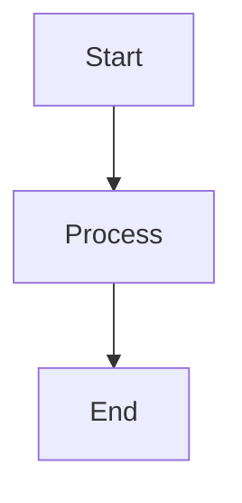

[](https://opensource.org/licenses/MIT)

This is a [Remarkable](https://github.com/jonschlinkert/remarkable) plugin that converts
[Mermaid](https://mermaid.js.org/) diagram code blocks between ````mermaid...``` delimiters into HTML for client-side rendering. It should not interfere with any other Markdown processing and supports all Mermaid diagram types including flowcharts, sequence diagrams, class diagrams, and more.

# Overview

This plugin works as a post-processor on HTML content when `html: true` is enabled in Remarkable. It transforms mermaid code blocks in the rendered HTML into mermaid divs and adds the necessary client-side rendering script.

**Features:**
- 🌐 **Client-side rendering**: Converts mermaid code blocks to client-side renderable divs
- 🎨 **Customizable styling**: Add custom CSS classes and configure themes
- 🔧 **Easy integration**: Works as a simple post-processor on HTML content
- ⚡ **Performance optimized**: Lightweight processing with automatic script injection
- 🔒 **Re-rendering prevention**: Automatically marks rendered diagrams to prevent duplicate rendering
- 📋 **Flexible script inclusion**: Option to include or exclude client-side rendering script

# To Use

## Installation

Install this package using `npm`:

```bash
npm install remarkable-mermaid-plus
```

## Dependencies

- **Required**: None (works with client-side rendering)
- **Client-side**: [Mermaid.js](https://mermaid.js.org/) library (automatically included via CDN)

Assuming you already have `Remarkable` installed, one way to use would be like so:

**CommonJS**

```javascript
const {Remarkable} = require('remarkable');
const plugin = require('remarkable-mermaid-plus');
const md = new Remarkable({
  html: true  // Required for post-processing
});

// Basic usage with default settings
md.use(plugin);

// With custom configuration
md.use(plugin, {
  theme: 'dark',
  customClass: 'my-mermaid-class'
});
```

**ES6**

```javascript
import {Remarkable} from 'remarkable';
import rmermaid from 'remarkable-mermaid-plus';

const md = new Remarkable({
  html: true  // Required for post-processing
});

// Basic usage with default settings
md.use(rmermaid);

// With custom styling
md.use(rmermaid, {
  theme: 'default',
  customClass: 'diagram w-full'
});
```

If you use TypeScript, you can import the plugin with the correct types by steps as follows:

```typescript
// remarkable-mermaid-plus.d.ts
// create this file in any directory you want, such as "types/remarkable-mermaid-plus.d.ts"
declare module 'remarkable-mermaid-plus' {
  interface MermaidOptions {
    theme?: 'default' | 'neutral' | 'dark' | 'forest' | 'base';
    customClass?: string;
    securityLevel?: 'strict' | 'loose' | 'antiscript' | 'sandbox';
    fontFamily?: string;
    fontSize?: number;
    includeScript?: boolean;
    flowchart?: object;
    sequence?: object;
    class?: object;
    gitGraph?: object;
  }
  const rmermaid: (md: any, options?: MermaidOptions) => void;
  export = rmermaid;
}
```

Then add `"types": ["types/remarkable-mermaid-plus.d.ts"]` to your `tsconfig.json`

```json
{
  "compilerOptions": {
    "include": [
      "types/remarkable-mermaid-plus.d.ts"
    ]
  }
}
```

# Configuration

The plugin accepts several configuration options:

## Basic Configuration

```javascript
{
  theme: 'default',           // Mermaid theme (default: 'default')
  customClass: '',          // Additional CSS classes (default: '')
  securityLevel: 'loose',   // Security level (default: 'loose')
  fontFamily: 'arial',      // Font family (default: 'arial')
  fontSize: 16,             // Font size (default: 16)
  includeScript: true,      // Include rendering script (default: true)
  flowchart: {},            // Flowchart configuration (default: {})
  sequence: {},             // Sequence diagram configuration (default: {})
  class: {},                // Class diagram configuration (default: {})
  gitGraph: {}              // Git graph configuration (default: {})
}
```

### Options

- **`theme`** (string): Mermaid theme. Options: `'default'`, `'neutral'`, `'dark'`, `'forest'`, `'base'`. Default is `'default'`.
- **`customClass`** (string): Additional CSS class names to add to the diagram container div. Default is empty string.
- **`securityLevel`** (string): Security level for mermaid rendering. Options: `'strict'`, `'loose'`, `'antiscript'`, `'sandbox'`. Default is `'loose'`.
- **`fontFamily`** (string): Font family for diagrams. Default is `'arial'`.
- **`fontSize`** (number): Font size for diagrams. Default is `16`.
- **`includeScript`** (boolean): Whether to include the client-side rendering script. Set to `false` if you want to handle script loading separately. Default is `true`.
- **`flowchart`** (object): Flowchart-specific configuration options. Default is `{}`.
- **`sequence`** (object): Sequence diagram-specific configuration options. Default is `{}`.
- **`class`** (object): Class diagram-specific configuration options. Default is `{}`.
- **`gitGraph`** (object): Git graph-specific configuration options. Default is `{}`.

## Supported Diagram Types

This plugin supports all Mermaid diagram types:

- **Flowcharts**: `graph TD`, `graph LR`, `flowchart TD`, etc.
- **Sequence Diagrams**: `sequenceDiagram`
- **Class Diagrams**: `classDiagram`
- **State Diagrams**: `stateDiagram`
- **Entity Relationship Diagrams**: `erDiagram`
- **User Journey**: `journey`
- **Gantt Charts**: `gantt`
- **Pie Charts**: `pie`
- **Git Graphs**: `gitgraph`

## Configuration Examples

### Basic Usage
```javascript
const md = new Remarkable({ html: true });
md.use(rmermaid);

const result = md.render(`
\`\`\`mermaid
graph TD
    A[Start] --> B[Process]
    B --> C[End]
\`\`\`
`);
```

### With Custom Styling
```javascript
const md = new Remarkable({ html: true });
md.use(rmermaid, {
  theme: 'dark',
  customClass: 'diagram bordered shadow'
});
```

### With Advanced Configuration
```javascript
const md = new Remarkable({ html: true });
md.use(rmermaid, {
  theme: 'light',
  customClass: 'my-diagram',
  securityLevel: 'strict',
  fontFamily: 'Helvetica, sans-serif',
  fontSize: 14,
  includeScript: true,
  flowchart: {
    useMaxWidth: true,
    htmlLabels: true
  },
  sequence: {
    useMaxWidth: true,
    wrap: true
  }
});
```

### Without Script Inclusion
```javascript
const md = new Remarkable({ html: true });
md.use(rmermaid, {
  theme: 'dark',
  customClass: 'diagram',
  includeScript: false  // Handle script loading separately
});
```

## HTML Output

The plugin transforms mermaid code blocks into client-side renderable divs:

### Input Markdown
```markdown

```

### Output HTML
```html
<div class="mermaid my-custom-class" id="mermaid-1234567890-abc123">
graph TD
    A[Start] --&gt; B[Process]
    B --&gt; C[End]
</div>
<script src="https://cdnjs.cloudflare.com/ajax/libs/mermaid/10.9.3/mermaid.min.js"></script>
<script>
// Mermaid initialization and rendering script
</script>
```

After client-side rendering, the diagram element gets a `data-mermaid-rendered="true"` attribute to prevent re-rendering:

```html
<div class="mermaid my-custom-class" id="mermaid-1234567890-abc123" data-mermaid-rendered="true">
  <svg><!-- Rendered SVG content --></svg>
</div>
```

# Dependencies

## Required
- **[Remarkable](https://github.com/jonschlinkert/remarkable)** with `html: true` option enabled

## Client-side (automatically included)
- **[Mermaid.js](https://mermaid.js.org/)** -- Client-side diagram rendering (loaded via CDN)

# Tests

There are a set of [Vows](http://vowsjs.org) tests in [index.test.js](index.test.js). To run:

```bash
% npm test
```

> **NOTE**: if this fails, there may be a path issue with `vows` executable. See [package.json](package.json).
